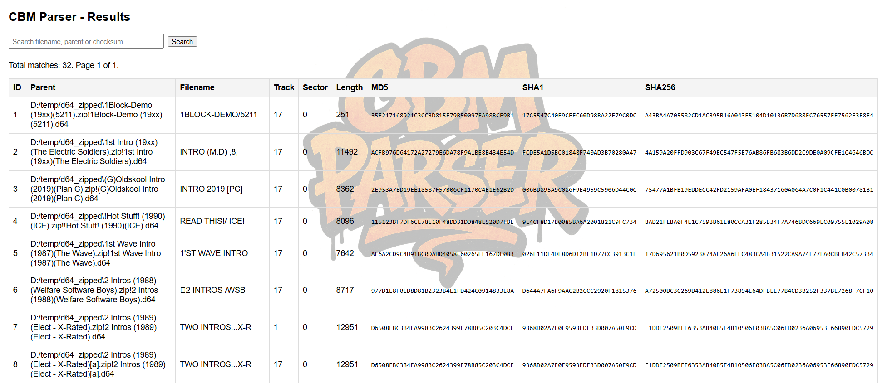

# cbm-parser

A simple, fast D64 disk image parser for Commodore 1541/CBM disks. It scans a directory for supported files, extracts PRG entries from .d64 images (directly or when nested inside .zip or .7z archives), and writes a compact index into a local SQLite database.

_Reference: frontend overview_

What you get in the database for every file found:
- parent: the container path (e.g., C:\path\image.d64 or archive.zip!disk.d64)
- filename: PETSCII-decoded name stored in the directory entry
- track, sector: starting location of the file on the disk image
- length: byte length of extracted data
- md5, sha1, sha256: hashes of the extracted data

Features
- Parses raw .d64 images
- Parses .zip archives and indexes any .d64 inside
- Parses .7z archives and indexes any .d64 inside
- Recursively scans directories for supported files
- Multi-threaded consumer workers via Tokio
- Stores results in a single SQLite file (uses rusqlite with bundled SQLite)
- Built-in local web frontend at http://127.0.0.1:3000 to browse/search the DB

Requirements
- Rust (stable) toolchain with Cargo
- Windows, macOS, or Linux (tested on Windows; paths in examples use Windows style)

The project uses these crates: tokio, clap, rusqlite (bundled), zip, sevenz-rust2, md5, sha1, sha256, petscii, endian_codec, hex-slice.

Build
- Debug build: cargo build
- Release build: cargo build --release

The compiled binary will be in target\debug\cbm-parser.exe or target\release\cbm-parser.exe.

Usage
Basic invocation scans a directory (recursively) for files and writes results into a SQLite DB file.

While running, a simple local web UI is available at http://127.0.0.1:3000 for browsing and searching the SQLite database.

- cargo run -- --path C:\disks
- cargo run -- --path C:\disks --dbfile my_index.sqlite
- cargo run -- --path C:\disks --threads 8

Flags
- --path, -p: Directory to scan for files (required)
- --dbfile, -d: Output SQLite file path (default: d64_files.sqlite)
- --threads, -t: Number of worker tasks (default: 4)
- --verbose, -v: Verbose output (currently minimal effect)

What gets scanned
- Files with extensions: d64, zip, 7z (case-insensitive)
- Directories are scanned recursively
- For .zip and .7z, only entries ending with .d64 are processed

Example output
- On start: simple d64 parser v0.1
- When done: <N> files parsed

Database schema
A files table is created if needed:

CREATE TABLE IF NOT EXISTS files (
  id INTEGER PRIMARY KEY AUTOINCREMENT,
  parent TEXT NOT NULL,
  filename TEXT NOT NULL,
  track INTEGER NOT NULL,
  sector INTEGER NOT NULL,
  length INTEGER NOT NULL,
  md5 TEXT NOT NULL,
  sha1 TEXT NOT NULL,
  sha256 TEXT NOT NULL
);

Example query snippets (using sqlite3 CLI):
- .open d64_files.sqlite
- .headers on
- SELECT parent, filename, length, sha256 FROM files ORDER BY parent, filename LIMIT 20;

How it works (high level)
- Producer lists entries in the given directory and sends each to workers via async-channel
- Each consumer picks a path and dispatches to a parser based on extension
  - d64: reads the image and extracts PRG entries
  - zip: iterates entries, extracts any .d64 images into memory and processes them
  - 7z: streams any .d64 entries and processes them
- For each PRG file found, an Element with metadata is queued and flushed to SQLite in batches

Limitations and notes
- Only .d64 disk images are supported; other CBM formats are not yet handled
- 7z parsing currently uses a placeholder password ("pass") to open archives; adjust if needed
- The web frontend currently always binds to 127.0.0.1:3000;
- Filename decoding relies on PETSCII handling in the codebase
- Error handling is intentionally lightweight; failures are logged and processing continues

Contributing
- Issues and PRs are welcome. Areas to improve:
  - Add support for more CBM disk formats (.g64, .nib)
  - Better error handling and logging
  - Configurable 7z password handling
  - Optional export of extracted PRG data
  - Make web frontend port configurable via CLI

License
- No explicit license file was found. If you are the author, consider adding a LICENSE file. If you plan to use this code, verify licensing terms with the repository owner.

Status
- Current local date and time for this README: 2025-08-25 11:35.